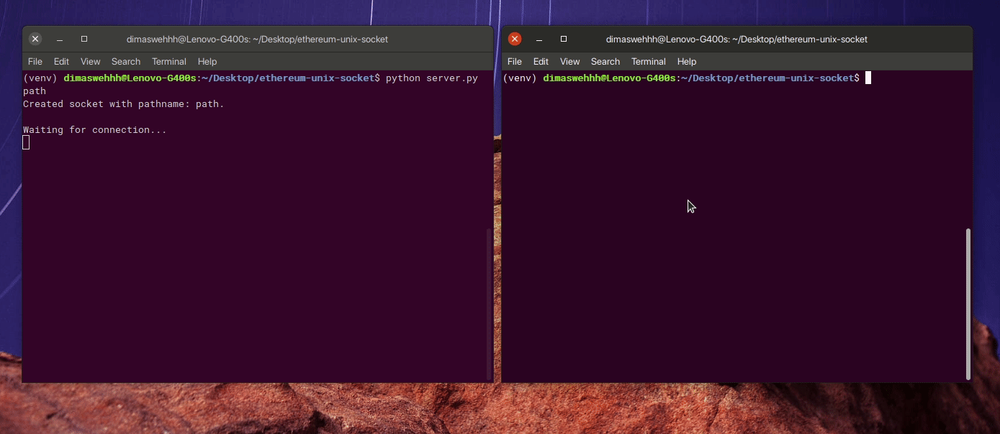

# ethereum-unix-socket

| [how it works](#how-it-works) | [some correcton notes](#some-correction-notes) | [some notes before start](#some-notes-before-start) | [languages feature(s)](#language-features) | [package dependencies](#package-dependencies) | [first setup](#first-setup) | [basic operation](#basic-operation) |

**ethereum-unix-socket** is an UNIX-domain-socket-based program for Ethereum transaction signature.



## how it works

[back to top](#ethereum-unix-socket)

This program uses **UNIX domain socket**, the way we can used for communicate through filesystem (specific pathname) on the single host. There is `server.py` (shortcut: `vault`) which processes data to generate **signed hash Ethereum transaction** based on client input, and `client.py` which receives some input from file to be sent into server.

- The program will receives transactions input (in string), **aggregates** all transactions input in single line separated by delimiter characters `\n`, and send them into server.
  ```
  {tx1}\n{tx2}\n{tx3}\n...
  ```
- Server receives all aggregates transaction, splits them based on the delimiter `\n`, and processes them into signed transactions and send them to client one by one.
- Client receives the signed transactions to be printed.

[back to top](#ethereum-unix-socket)

## some correction notes

[back to top](#ethereum-unix-socket)

- Realizing that every single stream has not fixed size, I created some reading-loop-process to make sure that all single line is read until the new line from input.
- Realizing that the transaction fees has to be already included, I've calculated the transaction fee based on `eth_gasPrice` and `eth_estimateGas` and resolved it into value subtraction (`value` -= (`eth_gasPrice` * `eth_estimate_gas`))
- I'm still confused since I intended to process **multiple line of transactions** (for instance, we have transaction **input from file**). Since the program is intended to construct a transaction signature without being broadcasted yet, I might be think to add some **entry number** from 0 (to be added by `nonce`) to make sure all multiple transactions can be broadcasted sequentially. But we have to restart the client socket once if the `signed_tx` has already been broadcasted (because the transaction count is updated on the network).

[back to top](#ethereum-unix-socket)

## some notes before start

[back to top](#ethereum-unix-socket)

- All input data are assumed to be valid containing `id`:`int`, `type`:`string`, `from_address`:`string`, `to_address`:`string`, and `amount`:`string` to make valid output data containing `id`:`int` and `tx`:`string`.
- Every input object has the same `type` properties by value: `sign_transfer`.
- Every input object has the same `from_address` (sender wallet address). In this case, I'm currently using `0xACa20B87dAEFe8a89f80E15493609bE116c8efc5` as a wallet address.
- Because signing transaction requires **private key** and private key is **too sensitive** to be shared publicly, I created the **hidden file** with filename `.<sender-address>.txt`. You can see the file by typing `ls -la` for displaying all files (including hidden).
- Using `eth_gasPrice` and `eth_estimateGas` JSON-RPC API, I've got gas price value by 1 gwei (1E9 wei) on all testing transactions (`transaction_input.txt`) according to `eth_gasPrice`. I've also got estimated gas usage by `21000` wei according on `eth_estimateGas`.
- I've set the `gas` properties on **all transactions** to 2000000 (more than value from `eth_estimateGas` for speed purpose) and `gasPrice` by 1000000000 (1 gwei according to `eth_gasPrice`).
- Knowing **transaction fees** = **gas usage** * **gas price**, I've got fees by 0.000021 Ether (21E12 wei) in all my testing samples (I might be able to assume that current transaction fee in this case is 0.000021 Ether).

[back to top](#ethereum-unix-socket)

## languages feature(s)

[back to top](#ethereum-unix-socket)

Python 3

[back to top](#ethereum-unix-socket)

## package dependencies

[back to top](#ethereum-unix-socket)

You can see the packages requirements in `requirements.txt` file.

[back to top](#ethereum-unix-socket)

## first setup

[back to top](#ethereum-unix-socket)

```bash
python3 -m venv venv
source venv/bin/activate
pip install -r requirements.txt
```

[back to top](#ethereum-unix-socket)

## basic operation

### Run the UDS server, where `<pathname>` is required.

[back to top](#ethereum-unix-socket)

```bash
python3 server.py <pathname>
```

or

```bash
./vault <pathname>
```

[back to top](#ethereum-unix-socket)

### Run the UDS client

[back to top](#ethereum-unix-socket)

You can run the UDS client to interact with UDS server with the same `<pathname>` as `server.py` or `vault` after the socket is `started`.

```bash
python3 client.py <pathname>
```

After starting `client.py`, you can input some string input (using JSON format) to be processed (generate signed hash output) in server. You can terminate the client by typing `\n` on client console.

[back to top](#ethereum-unix-socket)